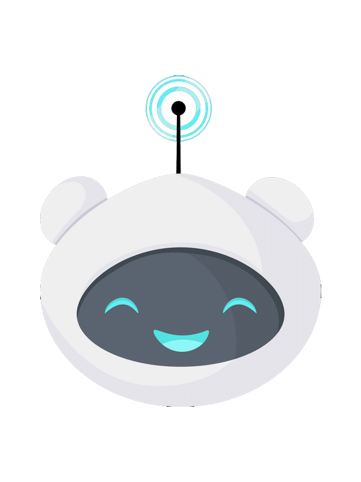
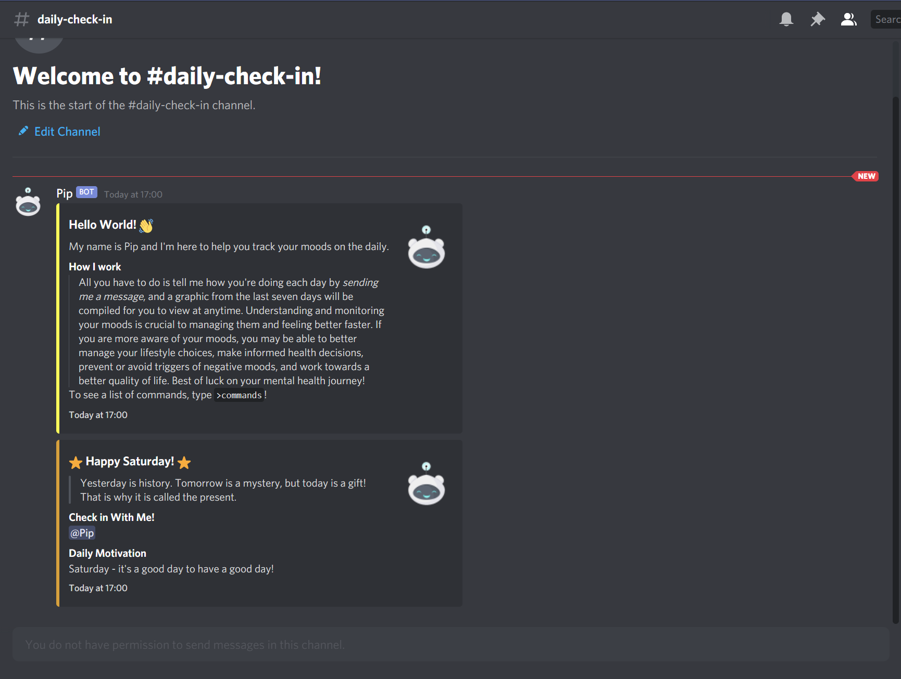
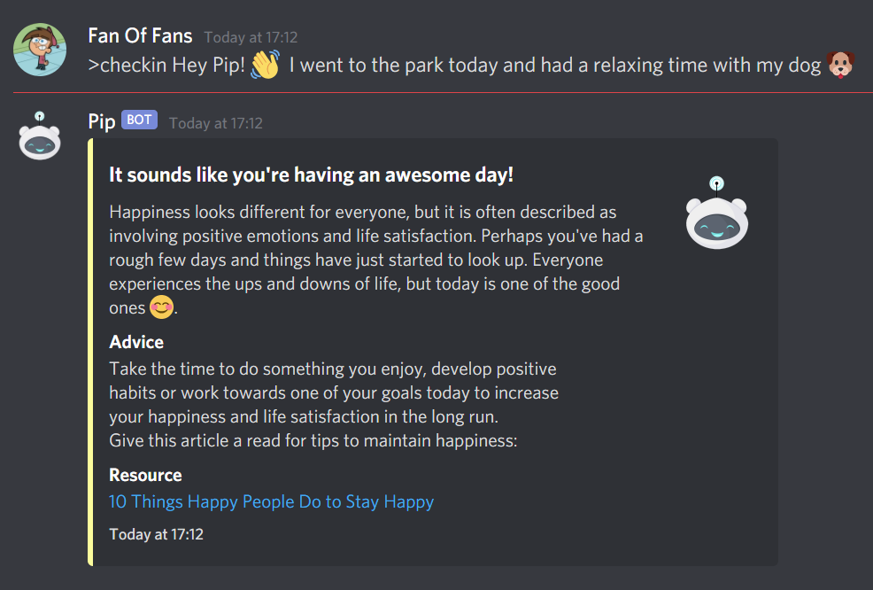
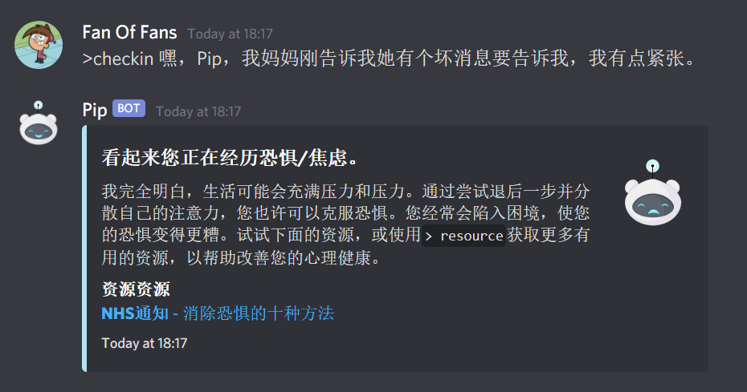
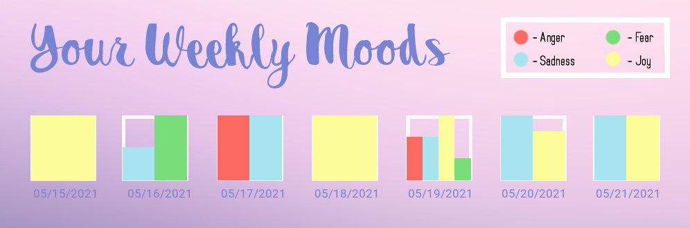

<!-- PROJECT LOGO -->
<br />
<p align="center">
  <a href="https://checkinwithme.tech/">
    
  </a>

  <h3 align="center">CheckinWithme</h3>
  <h4 align="center"><a href="https://devpost.com/software/check-in-with-me" target="_blank">(Winning!!) Hackathon Submission for Mental Health Hacks 2021</a></h4>
  <h4 align="center"><a href="https://checkinwithme.tech/" target="_blank">» Invite me!</a></h4>

  <p align="center">
    An AI mood-tracking Discord bot powered by
    <br /> <a href="https://www.datastax.com/products/datastax-astra">DataStax Astra's Apache Cassandra Databases</a> | <a href="https://www.heroku.com/">Heroku CI/CD</a> | <a href="https://cloud.google.com/">Google Cloud</a> 
    <br /> <a href="https://www.domain.com/">Domain.com</a> | <a href="https://www.ibm.com/watson/services/tone-analyzer/">IBM Watson Tone Analyzer</a>
    <br />
    <br />
    <a href="https://github.com/Ti1mmy/CheckinWithme/blob/main/README.md"><strong>Explore the docs »</strong></a>
    <br />
    <br />
    <a href="https://youtu.be/3dEZM6ImQrQ">View Demo</a>
    ·
    <a href="https://github.com/Ti1mmy/CheckinWithme/issues">Report Bug</a>
    ·
    <a href="https://github.com/Ti1mmy/CheckinWithme/issues">Request Feature</a>
  </p>
</p>


<!-- TABLE OF CONTENTS -->
<details open="open">
  <summary><h2 style="display: inline-block">Table of Contents</h2></summary>
  <ol>
    <li>
      <a href="#about-the-project">About The Project</a>
      <ul>
        <li><a href="#built-with">Built With</a></li>
      </ul>
    </li>
    <li>
      <a href="#getting-started">Getting Started</a>
      <ul>
        <li><a href="#prerequisites">Prerequisites</a></li>
        <li><a href="#installation">Installation</a></li>
      </ul>
    </li>
    <li><a href="#usage">Usage</a></li>
    <li><a href="#roadmap">Roadmap</a></li>
    <li><a href="#contributing">Contributing</a></li>
    <li><a href="#license">License</a></li>
    <li><a href="#contact">Contact</a></li>
    <li><a href="#acknowledgements">Acknowledgements</a></li>
  </ol>
</details>


<!-- ABOUT THE PROJECT -->
## About The Project

[](https://checkinwithme.tech)

[](https://checkinwithme.tech)

Pip is a Discord bot that aims to improve mental health through a multitude of functions. By combining IBM Watson’s tone analyzer and Google Cloud’s natural language processing sentiment, Pip can analyze messages and accurately determine the user's mood. Using the mood detected, Pip then responds accordingly, providing the user with support in the form of an uplifting message and the appropriate resources to help with how they are feeling. The user can also view their moods for the last 7 days in an easy-to-view graphic, which will help them identify things in their life that affect their mental well-being and make adjustments.

Alongside the mood tracking feature, Pip also offers a variety of other mental health services. Every 24 hours, Pip will send a message to give the user a mood boost and remind them to log their emotions. In case they feel down, Pip also has a motivation command that will automatically retrieve a motivational post from a never-ending list of options hand-curated by thousands of users. Finally, Pip can provide mental health resources on command if the user needs some more targeted resources.


### Built With

* [DataStax Astra Database](https://www.datastax.com/products/datastax-astra)
* Hosted on [Heroku](https://www.heroku.com/)
* [Google Cloud Translation/Natural Language Apis](https://cloud.google.com/)
* [IBM Watson Tone Analyzer](https://www.ibm.com/watson/services/tone-analyzer/)


<!-- GETTING STARTED -->
## Getting Started

To get a local copy up and running, follow these simple steps.

### Prerequisites

* Python `3.9`, `pip3`

1. Update before installing new packages

   ```sh
   sudo apt-get update
   ```
2. Check Python version

   ```sh
   python3 --version
   ```
3. If Python version < `3.9`

   ```sh
   sudo apt install python3.9
   ```
4. Validate

   ```sh
   python3.9 --version
   ```
5. Install `pip3`

   ```sh
   sudo apt-get -y install python3-pip
   ```
6. Validate

   ```sh
   pip3 --version
   ```


### Installation

1. Clone the repo
   ```sh
   git clone https://github.com/Ti1mmy/CheckinWithme.git
   ```
2. `cd` into repo directory
   ```sh
   cd CheckinWithme
   ```
3. Install Prerequisite Libraries
   ```sh
   pip3 install -r requirements.txt
   ```
4. Configure [DataStaxAstra Cassandra Database](https://astra.datastax.com/)
    * Initialize CQL Database with keyspace `my_moods`
    * Click on **Connect** in the initialized database. Download and add `secure-connect-database-name.zip` to main directory.
5. Configure [Google Cloud Services](https://cloud.google.com/)
    * Create Service Account with `owner` role
    * Enable [Cloud Translation API](https://console.cloud.google.com/marketplace/product/google/translate.googleapis.com)
    * Enable [Cloud Natural Language API](https://console.cloud.google.com/marketplace/product/google/language.googleapis.com)
6. **-- DEPRECATED --** ~~Add tokens to `config/config.json`~~
    * Bot tokens for Discord can be found in the [Discord Developer Portal](https://discord.com/developers/docs/intro). 
    * Copy [tokens](https://astra.datastax.com/settings/tokens) from DataStax Astra Database into `config/config.json`
    * Download Google Cloud [Key JSON](https://console.cloud.google.com/apis/credentials/) to `/config/`
    * Include path to Google Cloud JSON in `config.json`


    * **NEW:** Only add `secure_connect_bundle` path into `congif/config.json`

   ```json
    {
      "_DataStax Astra Connect Bundle",
      "secure_connect_bundle": "./config/secure-connect-checkinwithme.zip",
      
      "_info": "Config system deprecated, add rest as environment variables!",
      "_Discord Bot": "Import Bot Tokens below if applicable",
      "token": "",
      "token_test": "",

      "_DataStacks Astra Keys_": "Import your DataStax Astra Keys below",
      
      "CLIENT_ID": "",
      "CLIENT_SECRET":"",

      "G_CLOUD_SERVICE_KEYFILE": "config/your-google-cloud-service-keyfile.json"
    }
   ```
7. **-- DEPRECATED --** ~~Add tokens for Reddit and IBM Watson Tone Analysis to `config/reddit_keys.json`, `config/watson.json`~~
    * Create an application using a Reddit account [here](https://www.reddit.com/prefs/apps) to find the required tokens
    * Create an IBM Watson Tone Analyzer instance [here](https://cloud.ibm.com/catalog/services/tone-analyzer) and import the API key and url
    

    * **NEW**: Add keys according to the **next step**
8. **NEW - 18 January 2022**: Add all keys to `PATH` instead!
* NB: If hosting on Heroku, use [this buildpack](https://github.com/gerywahyunugraha/heroku-google-application-credentials-buildpack).
```sh
export ASTRA_DB_APPLICATION_TOKEN=<token>;
export ASTRA_DB_ID=<Astra DB id>;
export ASTRA_DB_KEYSPACE=my_moods;
export ASTRA_DB_REGION=<region>;
export ASTRA_DB_SECRET=<secret>;
export DISCORD_SECRET=<discord bot token>;
export GOOGLE_APPLICATION_CREDENTIALS=google-credentials.json;
export GOOGLE_CREDENTIALS=<contents of json>;
export REDDIT_USER=<reddit username>;
export REDDIT_PASS=<reddit password>;
export REDDIT_APP=<APP id>;
export REDDIT_SECRET=<reddit secret>;
export WATSON_KEY=<ibm watson key>;
export WATSON_URL=<ibm watson url>
```


<!-- USAGE EXAMPLES -->
## Usage

#### Joining
When Pip joins your server, it will create a read-only channel called `#daily-check-in`. Every 24 hours, Pip will make an announcement reminding you to message it with a quick message on how your day is going so far.
#### Check-In
Whenever you feel like logging how you feel, you can save an entry by messaging Pip using the `>checkin` command! Type out your message after the `>checkin` command for Pip to analyze and log how you feel. 
  * If you feel more comfortable expressing how you feel in your own language, Pip is completely able to understand your language as well as responding back using the **same language**!
  * Pip logs your emotions throughout the day! You can let Pip know how you are feeling at any time, not just once per day!
    * e.g. `>checkin Things have been going my way recently, I am grateful for my luck!`
    * par ex. `>checkin Les choses vont dans mon sens ces derniers temps, je suis reconnaissant pour ma chance!`

[](https://checkinwithme.tech)

#### History
Pip logs how you are feeling whenever you check in with it! You can view how you felt over the past seven days by viewing your `>history`!



#### Miscellaneous
  Rate: 
  * You can also let Pip know how you are feeling with the '`>rate`' command! Please include one of the following: `| Anger | Fear | Joy | Sadness |` with the command. This provides a more direct and accurate method for our systems to track your mood.
    * For instance, you could type `>rate Sadness` to let Pip know you're feeling down at the moment.
 
  Motivation:
  * Sends motivational messages to cheer you on to bigger and better.

  Resource
  * Generates a random resource to help you develop your mental health!

<!-- ROADMAP -->
## Roadmap

Optimizations:
  * Replace long if-else trees with native switch-statements upon Python `3.10` release.
  * Move embeds from `bot.py` to a separate file.

Features:
  * Voice Recognition in `>checkin`
    * Analyses .audio files that users record and send to bot
  * Interactive Web UI to explore mood history in more depth
  * Streak-detection
    * Identifies streaks in good moods and compliments users
  * Thoughts/Gratitude Journal Support
    * Stores & Analyzes Journals, easily accessible on future Web UI
  * Chatbot feature
    * Allows users to casually converse with the b


<!-- CONTRIBUTING -->
## Contributing

Contributions are what make the open source community such an amazing place to be learn, inspire, and create. Any contributions you make are **greatly appreciated**.

1. Fork the Project
2. Create your Feature Branch (`git checkout -b feature/AmazingFeature`)
3. Commit your Changes (`git commit -m 'Add some AmazingFeature'`)
4. Push to the Branch (`git push origin feature/AmazingFeature`)
5. Open a Pull Request


<!-- LICENSE -->
## License

Distributed under the MIT License. See `LICENSE` for more information.


<!-- CONTACT -->
## Contact

Eric Ji - [Linkedin](https://www.linkedin.com/in/eric-ji-0a8793212/) - eric868.ji@gmail.com

Katherine Li [Linkedin](https://www.linkedin.com/in/k-atherine-li/) - katherineli03.kkl@gmail.com

Timothy Zheng - [Linkedin](https://www.linkedin.com/in/timothyzheng/) - tim123643@gmail.com

Yang Xu - [Linkedin](https://www.linkedin.com/in/yang-xu-584b0920b/) - boyangfu1991@gmail.com


Devpost Link: [https://devpost.com/software/check-in-with-me](https://devpost.com/software/check-in-with-me)


<!-- ACKNOWLEDGEMENTS -->
## Acknowledgements

* Pip's avatar from [Canva](https://www.canva.com/), use granted through Pro subscription
* [MLH Mental Health Hacks](https://organize.mlh.io/participants/events/6797-mental-health-hacks)
* [Google Cloud Credits from Google](https://cloud.google.com/)
* [DataStax Astra Credits by DataStax Astra](https://www.datastax.com/products/datastax-astra)

