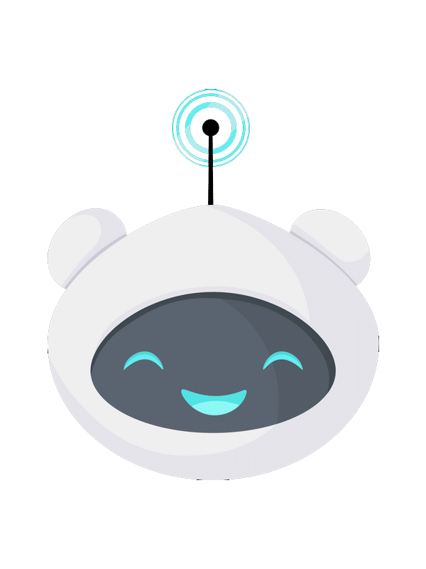

<!-- PROJECT LOGO -->
<br />
<p align="center">
  <a href="https://github.com/Ti1mmy/CheckinWithme">
    
  </a>

  <h3 align="center">CheckinWithme</h3>

  <p align="center">
    A mood-tracking Discord bot powered by
    <br /> <a href="https://www.datastax.com/products/datastax-astra" target="_blank">DataStax Astra's Apache Cassandra Databases</a> | <a href="https://www.linode.com/" target="_blank">Linode Cloud</a> | <a href="https://www.domain.com/" target="_blank">Domain.com</a> | <a href="https://www.ibm.com/watson/services/tone-analyzer/" target="_blank">IBM Watson Tone Analyzer</a>
    <br />
    <br />
    <a href="https://github.com/Ti1mmy/CheckinWithme/blob/main/README.md"><strong>Explore the docs »</strong></a>
    <br />
    <br />
    <a href="https://github.com/Ti1mmy/CheckinWithme">View Demo</a>
    ·
    <a href="https://github.com/Ti1mmy/CheckinWithme/issues">Report Bug</a>
    ·
    <a href="https://github.com/Ti1mmy/CheckinWithme/issues">Request Feature</a>
  </p>
</p>


<!-- TABLE OF CONTENTS -->
<details open="open">
  <summary><h2 style="display: inline-block">Table of Contents</h2></summary>
  <ol>
    <li>
      <a href="#about-the-project">About The Project</a>
      <ul>
        <li><a href="#built-with">Built With</a></li>
      </ul>
    </li>
    <li>
      <a href="#getting-started">Getting Started</a>
      <ul>
        <li><a href="#prerequisites">Prerequisites</a></li>
        <li><a href="#installation">Installation</a></li>
      </ul>
    </li>
    <li><a href="#usage">Usage</a></li>
    <li><a href="#roadmap">Roadmap</a></li>
    <li><a href="#contributing">Contributing</a></li>
    <li><a href="#license">License</a></li>
    <li><a href="#contact">Contact</a></li>
    <li><a href="#acknowledgements">Acknowledgements</a></li>
  </ol>
</details>


<!-- ABOUT THE PROJECT -->
## About The Project

[![Product Name Screen Shot][product-screenshot]](https://example.com)

Here's a blank template to get started:
**To avoid retyping too much info. Do a search and replace with your text editor for the following:**
`github_username`, `repo_name`, `twitter_handle`, `email`, `project_title`, `project_description`


### Built With

* [DataStax Astra Database](https://www.datastax.com/products/datastax-astra)
* Hosted on [Linode](https://www.linode.com/)
* [IBM Watson Tone Analyzer](https://www.ibm.com/watson/services/tone-analyzer/)


<!-- GETTING STARTED -->
## Getting Started

To get a local copy up and running follow these simple steps.

### Prerequisites

This is an example of how to list things you need to use the software and how to install them.
* Python `3.9`, `pip3`
1. Update before installing new packages
  ```sh
  sudo apt-get update
  ```
2. Check Python version
  ```sh
  python3 --version
  ```
3. If Python version < `3.9`
  ```sh
  sudo apt install python3.9
  ```
4. Validate
  ```sh
  python3.9 --version
  ```
5. Install `pip3`
  ```sh
  sudo apt-get -y install python3-pip
  ```
6. Validate
  ```sh
  pip3 --version
  ```


### Installation

1. Clone the repo
   ```sh
   git clone https://github.com/Ti1mmy/CheckinWithme.git
   ```
2. Install Prerequisite Libraries
   ```sh
   pip install -r requirements.txt
   ```
3. Configure DataStaxAstra Database
    * Initialize CQL Database with keyspace `my_moods`
    * Click on **Connect** in initialized database. Add `secure-connect-database-name.zip` to main directory.
4. Add tokens to `config/config.py`
    * Bot tokens for Discord can be found in the [Discord Developer Portal](https://discord.com/developers/docs/intro). 
    * Copy [tokens](https://astra.datastax.com/settings/tokens) from DataStax Astra Database into `config/config.json`
   
   ```json
   {
   "_Discord Bot": "Import Bot Tokens below if applicable",
   "token": "",
   "token_test": "",

   "_DataStacks Astra Keys_": "Import your DataStax Astra Keys below",
   "secure_connect_bundle": "<PATH-TO-SECURE-CONNECT-BUNDLE.zip>",
   "CLIENT_ID": "",
   "CLIENT_SECRET":"",
   }
   ```
5. Add tokens for Reddit and IBM Watson Tone Analysis to `config/reddit_keys.json`, `config/watson.json`
    * Create an application using a Reddit account [here](https://www.reddit.com/prefs/apps) to find the required tokens
    * Create an IBM Watson Tone Analyzer instance [here](https://cloud.ibm.com/catalog/services/tone-analyzer) and import the API key and url
   
   ```json
   // reddit_keys.json
   {
   "_Reddit": "Import Application Tokens Below:",
   "personal_use": "",
   "secret": ""
   }

   // watson.json
   {
   "Watson Tone Recognition AI": "Import API key and URL below:",
   "API_key": "",
   "url": ""
   }
   ```


<!-- USAGE EXAMPLES -->
## Usage

Use this space to show useful examples of how a project can be used. Additional screenshots, code examples and demos work well in this space. You may also link to more resources.

_For more examples, please refer to the [Documentation](https://example.com)_


<!-- ROADMAP -->
## Roadmap

See the [open issues](https://github.com/github_username/repo_name/issues) for a list of proposed features (and known issues).


<!-- CONTRIBUTING -->
## Contributing

Contributions are what make the open source community such an amazing place to be learn, inspire, and create. Any contributions you make are **greatly appreciated**.

1. Fork the Project
2. Create your Feature Branch (`git checkout -b feature/AmazingFeature`)
3. Commit your Changes (`git commit -m 'Add some AmazingFeature'`)
4. Push to the Branch (`git push origin feature/AmazingFeature`)
5. Open a Pull Request


<!-- LICENSE -->
## License

Distributed under the MIT License. See `LICENSE` for more information.


<!-- CONTACT -->
## Contact

Your Name - [@twitter_handle](https://twitter.com/twitter_handle) - email

Project Link: [https://github.com/Ti1mmy/CheckinWithme](https://github.com/Ti1mmy/CheckinWithme)


<!-- ACKNOWLEDGEMENTS -->
## Acknowledgements

* Pip's avatar from [Canva](https://www.canva.com/), use granted through Pro subscription
* [MLH Mental Health Hacks](https://organize.mlh.io/participants/events/6797-mental-health-hacks)
* []()

